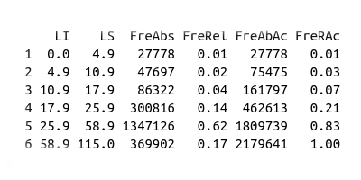
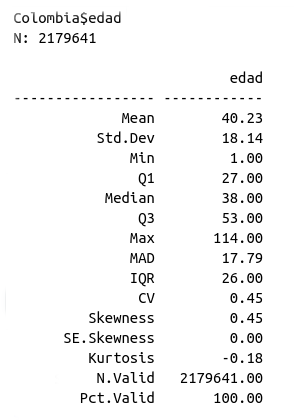

class: inverse
<br/><br/><br/>
# AGENDA
<br/>
## 1.  Actividad

## 2.  Dudas y Preguntas 

## 3. Varios

---
## Código R 

<br/><br/><br/><br/>
**Importar y preparar la base** <br/>
https://github.com/dgonxalex/dgonxalex.github.io/blob/main/CodigoU1_1.R
<br/><br/><br/>
**Construcción de tablas de frecuenciae indicadores** <br/>
https://github.com/dgonxalex/dgonxalex.github.io/blob/main/CodigoU1_2.R

---
## Construcción de tablas 

Resumirlos datos en tablas facilita su análisis y también su representación grafica. Varios gráficos están basados en tablas como veremos en la unidad 1.3

Antes de empezar vamos a cargar la base construida en el código anterior y las dos bases de Dataset de R

```{r}
Colombia=readRDS(file = "/home/deg/github/bases_proyectos/Colombia.RDS")
data(iris)
data(cars)
```

```{r}
head(iris)
```

---
## Tablas variables cualitativas (@)

```{r echo = FALSE}
# remotes::install_github("gadenbuie/xaringanExtra")
xaringanExtra::use_panelset()
```

.panelset[
  .panel[.panel-name[Opcion 1]

```{r}
FrecAbs=table(Colombia$ubicacion) # frecuencia absoluta
FreRel=prop.table(FrecAbs) # frecuencia relativa
cbind(FrecAbs,FreRel)
```
]
  .panel[.panel-name[Opcion 2]
```{r}
# install.packages("summarytools")
summarytools::freq(Colombia$ubicacion,big.mark = ",", cumul = FALSE, headings = FALSE)
```
  ]
.panel[.panel-name[Tablas cruzadas]
```{r}
table(Colombia$ubicacion, Colombia$estado)
```
  ]  
]
---
## Tablas variables cuantitativas (#)

```{r echo = FALSE}
# remotes::install_github("gadenbuie/xaringanExtra")
xaringanExtra::use_panelset()
```

.panelset[
  .panel[.panel-name[Preparación]

```{r, eval=FALSE}
summary(Colombia$edad)
# Min. 1st Qu.  Median    Mean 3rd Qu.    Max. 
# 1.00   27.00   38.00   40.23   53.00  114.00
```
Consultados los ciclos de la vida tenemos:
+ Primera Infancia (0-5 años)
+ Infancia (6 - 11 años)
+ Adolescencia (12 - 17 años)
+ Juventud (18 - 26 años)
+ Adultez (27- 59 años)
+ Persona Mayor (60 años o mas) 
]
  .panel[.panel-name[Construcción]
Constrimos la tabla a partir del histograma asi:  

```{r, eval=FALSE}
h=hist(Colombia$edad, breaks = c(0,4.9, 10.9,17.9,25.9, 58.9,115))
# Con los valores contenidos en el objeto h construimos la tabla
LI=h$breaks[1:6]
LS=h$breaks[2:7]
FreAbs=h$counts
FreRel=round(h$counts/sum(h$counts),2)
FreAbAc=cumsum(FreAbs)
FreRAc=cumsum(FreRel)
data.frame(LI,LS,FreAbs,FreRel, FreAbAc, FreRAc)
```
  ]

.panel[.panel-name[Gráfico]
```{r, fig.height=5}
hist(Colombia$edad, breaks = c(0,4.9, 10.9,17.9,25.9, 58.9,115))
```
  ]

.panel[.panel-name[Tabla de frecuencia]


  ]
]

---
# Indicadores para variables cualitativas (@)

```{r}
# install.packages("modeest")
library(modeest)
mfv(Colombia$ubicacion)
```

---
## Indicadores para variables cuantitativas (#)
```{r echo = FALSE}
# remotes::install_github("gadenbuie/xaringanExtra")
xaringanExtra::use_panelset()
```

.panelset[
  .panel[.panel-name[Opción 1]

```{r}
summary(Colombia$edad)
```
]
  .panel[.panel-name[Opción 2]
```{r}
psych::describe(Colombia$edad)
```
  ]

.panel[.panel-name[Opción 3]
```{r, eval=FALSE}
summarytools::descr(Colombia$edad)

```

  ]

]

---

## Actividades
<br/>
+ **Actividad 1** : Realice las  actividades consignadas en  el **Taller 1-01**.  Adjunte y envíe las respuesta a la plataforma de Blackboard en  formato pdf.
    + **Nota**: RMarkdown permite realizar el trabajo facilmente

<br/>
+ **Actividad 2** : A partir de la  información contenida en  la base de datos  seleccionada en la **Unidad 1.1**, realice un análisis de al menos una variable cualitativa y una cuantitativa teniendo como soportes las tablas de frecuencia y los indicadores estadísticos correspondiente.

<br/><br/><br/>
**Fecha**  : 14 de febrero 2021

**Hora**   : 23:59 hora local 

---
class: inverse, center
background-image: url("imagenes/surfing-2134595_960_720.jpg")

<br/><br/><br/><br/><br/><br/><br/><br/><br/><br/><br/><br/><br/><br/><br/>
### <p style="color:yellow"> La Estadistica te permite ver lo que otros no ven... </p>
#### <p style="color:yellow"> Daniel Enrique González Gómez </p>
Imagen tomada de : https://pixabay.com/es/images/search/paisaje/


