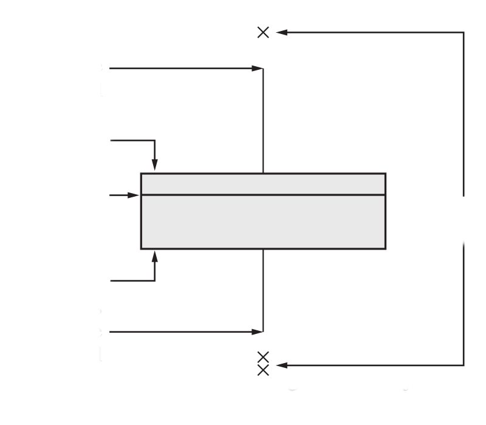
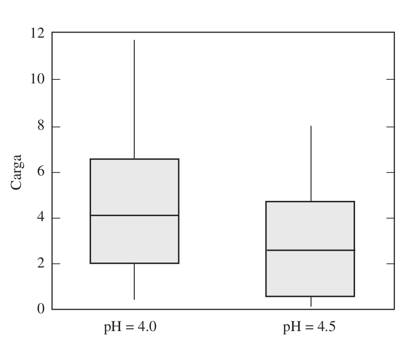
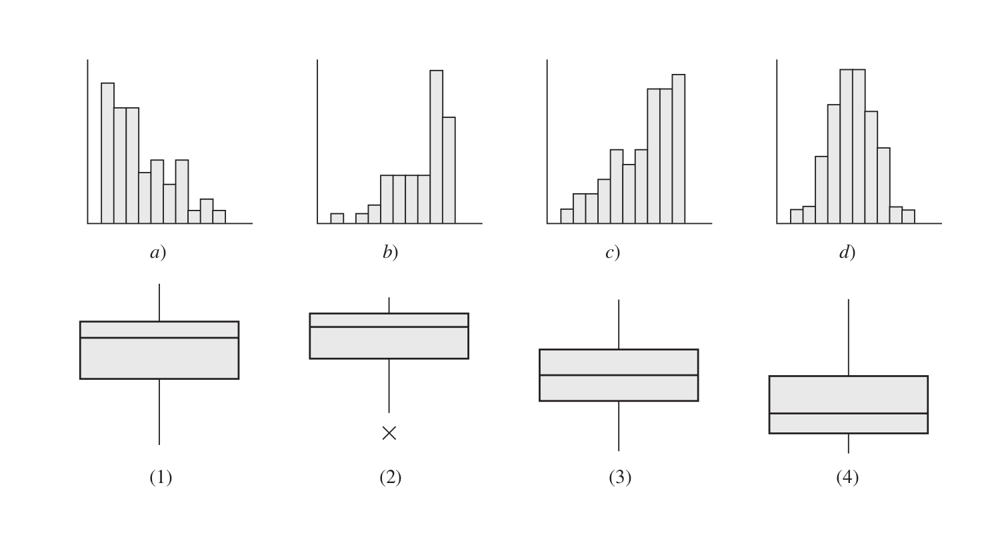
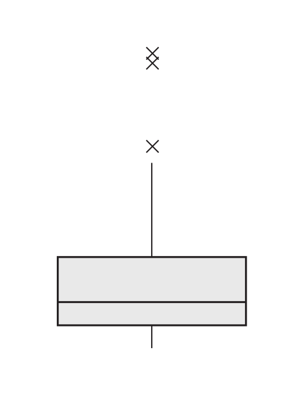

```{r xaringan-themer, include=FALSE, warning=FALSE}
library(xaringanthemer)
style_duo_accent(
  primary_color = "#1381B0",
  secondary_color = "#FF961C",
  inverse_header_color = "#FFFFFF"
)
```


class: inverse
<br/><br/><br/>
# AGENDA
<br/>
## 1.  Dudas y Preguntas   

## 2.  Actividad

## 3.  Varios
---

### 1. 

Elabore un gráfico para representar adecuadamente la siguiente información:

+ Durante 5 meses se construyen 134 kilómetros de carretera en la siguiente forma: 

    + En el primer més, 3.60% del total; 
    
    + El segundo més , 7.60% del total; 
    
    + El tercer més, el 15.3% del total; 
    
    + El cuarto més 24.5%  del total y 
    
    + En último més, el 49% restante.

---
### 2.
Elabore un gráfico para representar adecuadamente la siguiente información:

+ El grupo de Probabilidad y Estadística está conformado por: 

    + 20 estudiantes de Ingenieria Civil, 
    
    + 10 de Ingenieria de Sistemas y 
    
    + 5 Biologìa . 
    
    + De los que estudian Ingenieria Civi 15 son hombres; 
    
    + De los matriculados en Ingenieria de Sistemas 4 son mujeres y 
    
    + De los Biologos 2 son mujeres.

---
### 3.  
En el siguiente gràfico determine cada uno de los elementos señalados <br/>




---

.pull-left[
### 4.
Los siguientes son diagramas de caja que comparan la carga [en coulombs entre mol (C/mol) × 10 x 25 ] a pH 4.0 y a pH 4.5 para un conjunto de proteínas (del artículo “Optimal Synthesis of Protein Purification Processes”, E. Vasquez-Alvarez, M. Leinqueo y J. Pinto, en Biotechnology Progress 2001:685-695). Verdadero o falso:

+  La mediana de la carga para el pH 4.0 es mayor que el 75avo. percentil de la carga para el pH 4.5.
+  Aproximadamente 25% de las cargas para el pH 4.5 son menores que la carga más pequeña en el pH 4.0.

+ Cerca de la mitad de los valores de la muestra para el pH 4.0 están entre 2 y 4.

+ Hay una proporción mayor de valores fuera de la caja para el pH 4.0 que para el pH 4.5.

+ Ambas muestras están sesgadas a la derecha.

+ Ambas muestras contienen datos atípicos.
]

.pull-right[

]
---
### 5.
Relacione el siguiente grupo de histogramas y diagramas de caja que representan el mismo conjunto de datos: 

---
.pull-left[
### 6.
Con respecto a los datos que se representan en el siguiente diagrama de caja, ¿cuál de los enunciados siguientes es verdadero?

+ La media es más grande que la mediana.

+ La media es menor que la mediana.

+ La media es aproximadamente igual a la mediana.
]
.pull-right[

]
---
### 7.
Verdadero o falso: en cualquier diagrama de caja,

+ La longitud de los “bigotes” podría ser más grande que 1.5 IQR, donde el IQR es el rango intercuartil. 0.8 

+ La longitud de los “bigotes” podría ser menor que 1.5 IQR, donde el IQR es el rango intercuartil.

+ Los valores en los extremos de los “bigotes” son siempre valores del conjunto de datos que se usan para construir el diagrama de caja.
---
### 8.
En el artículo “Occurrence and Distribution of Ammonium in Iowa Groundwater” (K. Schilling, Water Environment Research, 2002:177-186), se midieron concentraciones de amonio (en mg/L) en un total de 349 pozos aluviales en el estado de Iowa. La media de la concentración fue de 0.27,
la mediana fue de 0.10 y la desviación estándar fue de 0.40.

Si se dibujara un histograma con estas 349 mediciones,

+ estaría sesgado a la derecha.

+ estaría sesgado a la izquierda.

+ sería aproximadamente simétrico.

+ su forma no se podría determinar sin conocer las frecuencias relativas.

---
background-image: url("imagenes/summarytool1.png")

### 9.
---
### **Recursos**

#### **Tablas**

https://cran.r-project.org/web/packages/kableExtra/vignettes/awesome_table_in_html.html

http://destio.us.es/calvo/ficheros/ComoCrearTablasRMarkdown_PedroLuque_2019Sep_librodigital.pdf

#### **Resumen de datos**

https://cran.r-project.org/web/packages/summarytools/vignettes/Introduction.html

https://mran.microsoft.com/snapshot/2018-06-06/web/packages/summarytools/vignettes/Introduction.html

#### **Dashboard**

http://enrdados.net/post/shiny-facil-con-flexdashboard/

https://rmarkdown.rstudio.com/flexdashboard/

https://katnoria.medium.com/quick-and-easy-dashboards-c90101ba8f16

---
class: inverse
background-image: url("imagenes/Ubuntu.jpg")

	<br/><br/><br/><br/><br/><br/><br/><br/><br/><br/><br/><br/>
	<br/><br/><br/><br/><br/><br/><br/><br/><br/><br/>


Imagen tomada de : https://www.tandemspring.com/ubuntu/ <br/>
problemas tomasdos de : Navidi (2006)

---
class: inverse


