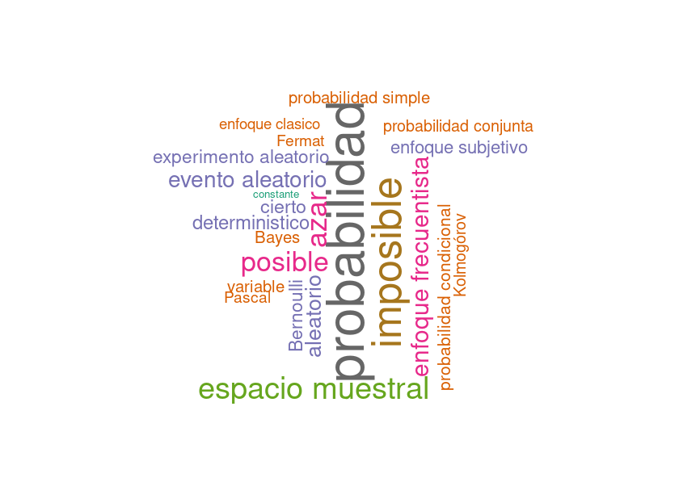

class: inverse
```{r setup, include=FALSE}
options(htmltools.dir.version = FALSE)
xaringanExtra::use_panelset()
```


<br/>
# AGENDA
<br/>
## 1.  Presentación guía de aprendizaje 2.1

## 2. Conceptos básicos de probabilidad

## 3. Enfoques de probabilidad

## 4. Varios

---
# PROBABILIDAD


### ¿Qué es......?

### ¿Cuál es su uso ......?

### ¿Como se mide ......?

### ¿Qué tipo de ...... existen?

### ¿Qué propuedades posee  ......?

---
# Son similares o diferentes?

###  aleatorio  - azar

###  deterministico - no deterministico

###  probable  - improbable

###  cierto  - incierto

---

Imagine que está jugando dados con un amigo. Él indica que hay tres posibilidades de resultados al lazar dos dados:

+ Que los dos resultados sean pares

+ Que los dos resultados sean impares

+ Que uno sea par y el otro impar <br/>

+ Pero además afirma que estos tres eventos son igualmente probables.
--
<br/>
<br/>
¿Que opina? , ¿Cómo podrı́a verificarse o contradecir esta afirmación?


---

---
## CONCEPTOS BASICOS DE PROBABILIDAD

### EXPERIMENTO ALEATORIO

### ESPACIO MUESTRAL

### EVENTO ALEATORIO


---
.panelset[
  .panel[.panel-name[EXPERIMENTO ALEATORIO]

Acción que puede ser replicada bajo las mismas condiciones y cuyo resultado no se conoce por anticipado

+ $E_1$ : Lanzar una moneda dos veces y observar los resultados obtenidos en sus caras
superiores

+ $E_2$ : Lanzar dos dados y observar la suma de los resultados superiores

+ $E_3$ : Realizar un examen de estadı́stica y observar el resultado obtenido

+ $E_4$ : En una salida de campo, observo si se cumple o no, totalmente el objetivo planteado
]

 .panel[.panel-name[ESPACIO MUESTRAL]

Conjunto de todos los posibles valores que puede tomar el experimento aleatorio. 

+ $S_{1}$ = $\{ (cc), (cs), (sc), (ss) \}$  

+ $S_{2}$ = $\{ 2,3,4,5,6,7,8,9,10,11,12 \}$ 

+ $S_{3}$ = $\{ x \in \mathbb{R} | 0 \leq x \leq 5   \}$ 

+ $S_{4}$ = $\{ x \in \mathbb{N}| 0 \leq x \leq 1 \}$ 

+ $S_{5}$ = $\{ x \in \mathbb{N}| 0 \leq x \leq 20 \}$

]

.panel[.panel-name[EVENTO ALEATORIO]

			
Subconjunto del espacio muestral que es de nuestro interés. 

+ $A_{1}$ : Se obtienen solo caras  

+ $A_{2}$ : La suma de los resultados es inferior a 6

+ $A_{3}$ : Se gana el examen 

+ $A_{4}$ : Se cumple el objetivo de la salida 

+ $A_{5}$: Se obtener más de 5 ensayos éxitos
]
]

---
## ENFOQUES DE PROBABILIDAD

### ENFOQUE CLASICO

### ENFOQUE FRECIENTISTA

### ENFOQUE SUBJETIVO

---
## ENFOQUE CLASICO

Es el enfoque más antiguo de probabilidad. La probabilidad bajo ese enfoque para el evento A se calcula como:

$P(A) = \dfrac{n(A)}{n(S)}$


Para : 
+ $E_1$ : Lanzar una moneda dos veces y observar los resultados obtenidos en sus caras
superiores

+ $E_2$ : Lanzar dos dados y observar la suma de los resultados superiores 

y
+ $A_{1}$: Se obtienen solo caras   

+ $A_{2}$: La suma de los resultados es inferior a 6
	
Encontrar	 

+ $P(A_{1}) =$ ?  
+	$P(A_{2}) =$ ? 

---
## Como calcular las siguientes probabilidades ?

+ $A_{3}$ : Se gana el examen  

+ $A_{4}$ : Se cumple el objetivo de la salida  

+ $A_{5}$ : Se obtener más de 5 ensayos éxitos

--
## ENFOQUE FRECIENTISTA

Este enfoque basa su cálculo en la frecuencia con que ocurre un evento en un tamaño de muestra determinado $n$.

$$\lim_{n \to{+}\infty}   P(A) =  \Bigg[ \dfrac{\text{número de veces que ocurre A}}{n} \Bigg]$$
---
.pull-left[
## ENFOQUE SUBJETIVO

En este caso la probabilidad es valorada y asignada por un **EXPERTO**, como un médico, un ingeniero, un abogado, biólogo, técnico , psicólogo, sociólogo, papá, mamá......
]

.pull-rigt[


]
---
AXIOMAS DE PROBABILIDAD

+ $A_{1}$:  Sea $S$ un espacio muestral  asociado a un experimento. Entonces $P(S)=1$ 

+ $A_{2}$:  Para cualquier evento $A$, se cumple que $0 \leq P(A) \leq 1$  

+ $A_{3}$:  Si $A$ y $B$ son dos eventos mutuamente excluyentes, entonces: 
$$P(A \cup B) = P(A) + P(B)$$ 

En general $P(A \cup B) = P(A)+ P(B) - P(A \cap B)$   

+ $A_{4}$: Para cualquier evento $A$, $P(A^c)=1-P(A) $  

+ $A_{5}$: La probabilidad de $P(\phi) =0$   

---
## PROBLEMAS PROPUESTOS

+ Determine la probabilidad de que en una mano de poker obtenga 21 con tres cartas seleccionadas de manera aleatoria.
<br/><br/>
+ Determine la probabilidad de que al destapar una ficha de dominó, sus puntos sean mayores a 4
<br/><br/>
+ Determine la probabilidad de que al lanzar dos dados:

   + a. la suma de los resultados sea mayor a 7

   + b. la resta de los números sea negativa

   + c. su multiplicación sea mayor a 20

   + d. en el caso de agregar otro dado (en total 3 dados), la suma esté entre 10 y 15

---
class: inverse center
background-image: url("imagenes/mariposa.jpg")

	<br/><br/><br/><br/><br/><br/><br/><br/><br/><br/><br/><br/>
	<br/><br/><br/><br/>
		<br/><br/><br/><br/>	<br/><br/>
	
##### <p style="color:yellow"> No intentes cambiar tu pasado, puede que de haber sido distinto todo hubiera sido peor... ( Efecto mariposa )
Imagen tomada de : https://www.caracteristicas.co/mariposas/


