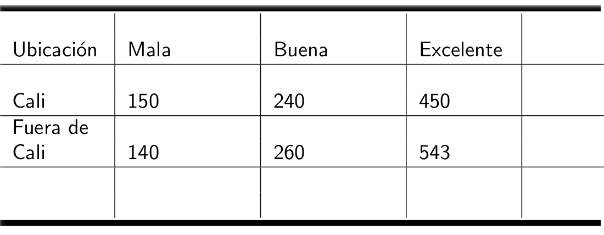
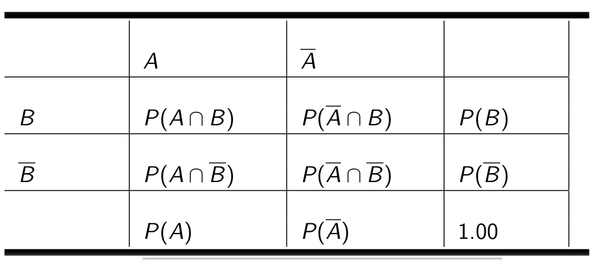
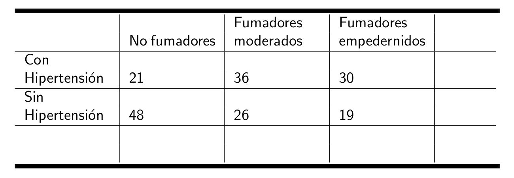
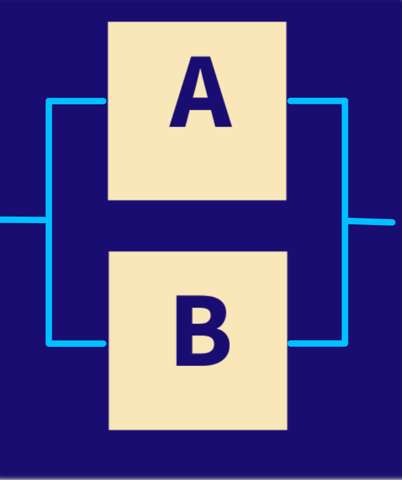

class: inverse
```{r setup, include=FALSE}
options(htmltools.dir.version = FALSE)
xaringanExtra::use_panelset()
```


<br/>
# AGENDA
<br/>
## 1. Dudas y preguntas

## 2. Tipos de probabilidad

## 3. Varios

---
class: inverse
---

## Conceptos básicos

+ **Experimento aleatorio** : acción que se puede repetir bajo las mismas condiciones y cuyo resultado no se conoce anticipadamente.

+ **Espacio muestral** : conjunto de todos los posibles resultados que puede tomar el experimento aleatorio.

+ **Evento aleatorios** : subconjunto del espacio muestral de nuestro interés

 ---

  **Ejemplo** : 
  
  + $E$: En un Banco de sangre se clasifica el tipo de sangre que tiene un donante 
  
  + $S=\{A+,A-,B+,B-,AB+,AB-,O+,O-\}$
  
  + $A=\{O+\}$
 
 
---
## Enfoques de probabilidad
<br/><br/>
**Clásico** : $P(A)=\dfrac{n(A)}{n(S)}$
<br/><br/>
**Frecuentista** : $\lim_{n \to{+}\infty}   P(A) =  \Bigg[ \dfrac{\text{número de veces que ocurre A}}{n} \Bigg]$

<br/>
<br/>
**Subjetivo** : $P(A)=$ asignada por un experto

---
## Tablas cruzadas o de doble entrada
Se realiza una encuesta a un grupo de jóvenes de la universidad con el fin de establecer la calidad de su servicio de internet y su ubicación . Los resultados obtenidos se presentan en la siguiente tabla:
<br/><br/><br/>

---

```{r}
m1=matrix(c(150,140,240,260,450,543), nrow = 2)
colnames(m1)=c("Mala","Buena","Excelente")
rownames(m1)=c("Cali","Fuera de Cali")
m1
```
**NOA**: Si tengo una base de datos puedo obtener la tabla con el comando
***t1=table(variable1, variable2)***
---


```{r}
m2=addmargins(m1, c(1, 2))
m2
```


---
 

**Probabilidades simples o marginales**

$P(A)$ : probabilidad de que ocurra $A$ <br/>
$P(A^{c})$ : probabilidad de que NO ocurra $A$<br/>
$P(B)$ : probabilidad de que ocurra $B$<br/>
$P(B^{c})$ : probabilidad de que NO ocurra $B$<br/>

**Probabilidades conjuntas**

$P(A∩B)$ : probabilidad de que ocurra $A$ y $B$<br/>
$P(A^{c}∩B)$ : probabilidad de que NO ocurra $A$ y ocurra $B$<br/>
$P(A∩B^{c})$ : probabilidad de que ocurra $A$ y NO ocurra $B$<br/>
$P(A^{c}∩B^{c})$ : probabilidad de que NO ocurra $A$ ni $B$<br/>

---
### Ejemplo 1

Se realiza una encuesta a un grupo de jóvenes de la universidad con el fin de establecer la calidad de su servicio de internet y su ubicación . Los resultados obtenidos se presentan en la siguiente tabla:

 
```{r}
m2
```


---
 

```{r}
round(addmargins(prop.table(m1), c(1, 2)), 4)
```
---
### Ejemplo 2

Un experimento que busca estudiar la relación que puede existir entre el habito de fumar y la hipertensión arterial encontró que para 180 personas el siguiente resumen. Calcule las probabilides marginales y las probabilidades conjuntas.

 
```{r, echo=FALSE}
n=c(21,48,36,26,30,19); 
m3=matrix(n,nrow = 2)
rownames(m3)=c("con hipertension", "sin hipertension")
colnames(m3)=c("no fumador", "fumador moderado", "fumador empedernido")
round(addmargins(prop.table(m3), c(1, 2)), 4)
```

---
### Probabilidad condicional

Cuando ocurren dos o mas eventos, puede ocurrir que ellos esten relacionados entre si. En estos casos la probabilidad de ocurrencia de un evento **B** cambia cuando ocurre otro evento **A**.

A la probabilidad de que ocurra **B** cuando sabemos que ha ocurrido **A**, se le conoce como **probabilidad condicional de B dado A**

$$P(B|A)=\dfrac{P(A∩B)}{P(A)} $$
.pull-left[
Como se pudrian representar las  probabilidad de los siguientes eventos:
 
]
.pull-right[
+ Si sabemos que la persona es un fumador empedernido, cuál será la probabilidad de que padezca de hipertensión
+ Sabemos que la persona tiene hipertensión, cuál será la probabilidad de que la persona no sea un fumador
+ Cuál será  la probabilidad de que una persona padezca de hipertensión, siendo que es un fumador moderado.
]


---
class: top, left 
 

<br/><br/><br/><br/>
```{r}
round(addmargins(prop.table(m3), c(1, 2)), 4)
```

---

### Eventos independientes

$$P(B|A)=\dfrac{P(A∩B)}{P(A)}=P(B)$$
Cuando la probabilidad de que ocurra **A**, no afecta la probabilidad de **B**, se dice que los eventos **A** y **B** son eventos independientes.

Y se cumple :

$$P(A∩B)=P(A)P(B)$$
**Ejemplo** : Verificar si los siguientes eventos representados una tabla de contingencia son independientes:
 

---
 
<br/><br/><br/><br/><br/><br/><br/><br/>

```{r}
round(addmargins(prop.table(m3), c(1, 2)), 4)
```
---
class: inverse
### Ejemplo 3 

Las siguientes figuras representan tres sistemas eléctricos,conectados en diferentes formas. Se tiene informacion que todos los componentes poseen igual probabilidad de falla ( $P(F)=0.05$ ). En cada caso determine la probabilidad de funcionamiento de cada sistema

 <br/><br/><br/>
 

```
---
class: inverse

---

class: inverse right
background-image: url("imagenes/balance-2121323_1920.jpg")
### <p style="color:yellow"> Cuando tomas decisiones sin estar informado, puedes correr riesgos... </p>
<p style="color:yellow"> Daniel Enrique González Gómez </p>
Imagen tomada de : https://pixabay.com/es/images/search/paisaje/


