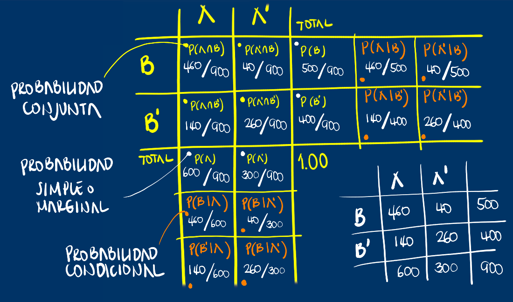
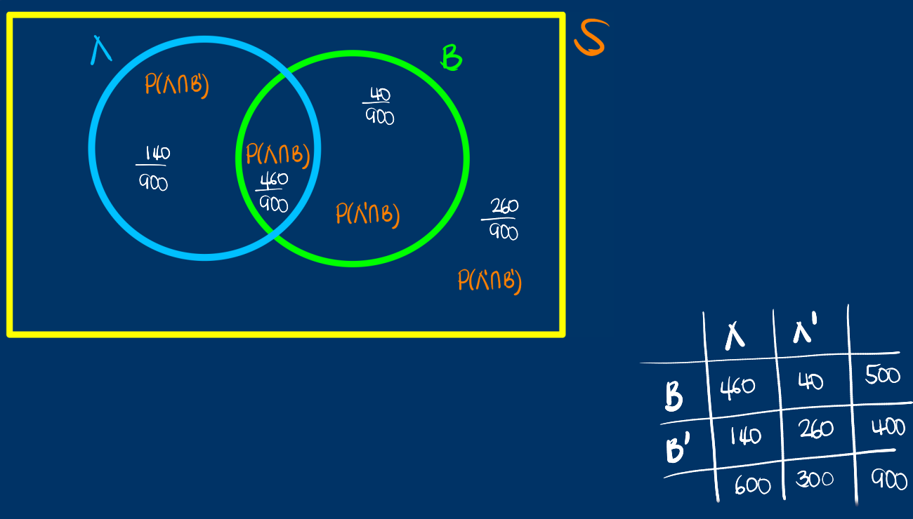
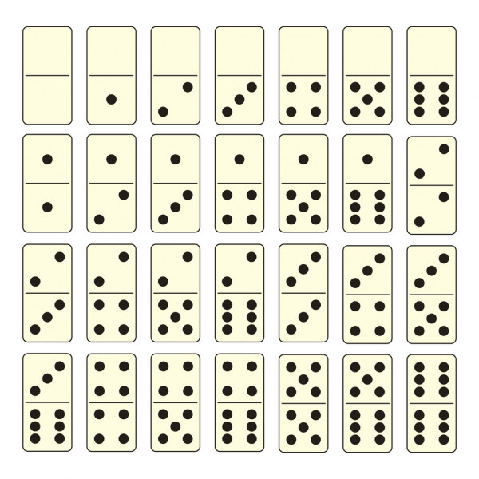

class: inverse
```{r setup, include=FALSE}
options(htmltools.dir.version = TRUE)
xaringanExtra::use_panelset()
```

<br/>
# AGENDA
<br/>
## 1. Dudas y preguntas

## 2. Problemas propuestos

## 3. Varios

---
class: inverse

.left-column[
## Tipos de probabilidad
]
.right-column[

]
---
class: inverse

---
class: inverse


---
class: inverse center middle

## PROBLEMAS PROPUESTOS
---
### 1.
Una compañia de seguros de automóviles trabaja con cuatro modelos de autos: $M_1$ , $M_2$ , $M_3$ y $M_4$ . Con información disponible del último año se ha elaborado la siguiente tabla:

.pull-left[
<html>
    <head>
        <title></title>
    </head>
    <body>
        <h1></h1>
        <table>
        <tr>
          <td><strong>
        </strong>Modelo</td>
          <td><strong>Proporcion de vehiculos</strong></td>
          <td><strong>Probabilidad de accidente</strong></td>
        </tr>
        <tr>
          <td>Modelo1</td>
          <td>0.27</td>
          <td>0.03</td>
        </tr>
        <tr>
          <td>Modelo2</td>
          <td>0.17</td>
          <td>0.02</td>
        </tr>
        <tr>
          <td>Modelo3</td>
          <td>0.35</td>
          <td>0.05</td>
        </tr>
         <tr>
          <td>Modelo4</td>
          <td>0.21</td>
          <td>0.04</td>
        </tr>       
          </table>
    </body>
</html>
]
.pull-right[

A partir de la informacion anterior :

+ Construya un diagrama de arbol

+ Construya una tabla cruzada

+ Construya un diagrama de Venn
]

---
### 2.
Un día de grados en la universidad, se selecciona aleatoriamente a un graduado. Sea **A** el evento que el estudiante está por terminar la carrera de ingeniería y sea **B** el
evento que el estudiante tomó un curso de cálculo en la universidad. 

¿Qué probabilidad es mayor, $P(A⏐B)$ o $P(B⏐A)$? . Explique. (Problema tomado de Navidi(2006))
---
### 3.
Los pozos de petróleo perforados en la región **A** tienen una probabilidad de 0.2 de producir. Los pozos perforados en la región **B** tienen una probabilidad de 0.09. Se perfora un pozo en cada región. Suponga que los pozos producen de manera independiente.

+ a) ¿Cuál es la probabilidad de que ambos pozos produzcan?

+ b) ¿Cuál es la probabilidad de que ninguno produzca?

+ c) ¿Cuál es la probabilidad de que al menos uno produzca?
---
### 4.
Determine la probabilidad de que al destapar una ficha de dominó, sus puntos sean mayores a 4

<br/><br/><br/>

---
### 5.
Determine la probabilidad de que al lanzar dos dados:

+ a. La suma de los resultados sea mayor a 7

+ b. La resta de los números sea negativa

+ c. Su multiplicación sea mayor a 20 

+ d. El resultado del dado1 sea mayor al del dado2 (existe un juego llamado guayabita que consiste en lanzar un dado y apostar dependiendo del resultado obtenido, pues se gana lo apostado si el segundo lanzamiento es mayor al valor obtenido en el primero)

+ e. En el caso de agregar otro dado (en total 3 dados), la suma esté entre 10 y 15
---
class: inverse

---
class: inverse right
background-image: url("imagenes/city-438393_1920.jpg")
### <p style="color:blue"> Si quieres resultados diferentes, no hagas siempre lo misno...</br></br>Albert Einstein </p>
Imagen tomada de : https://pixabay.com/es/images/search/paisaje/


