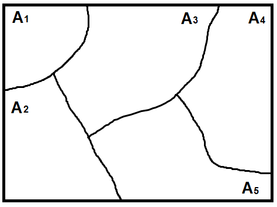
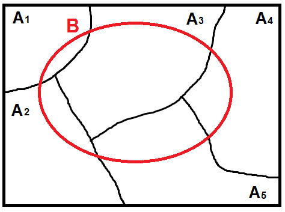
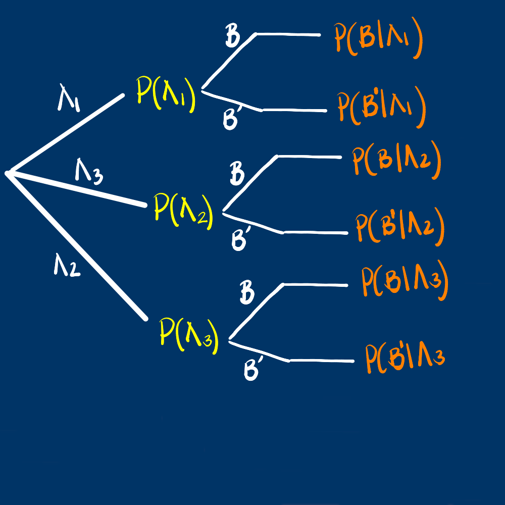
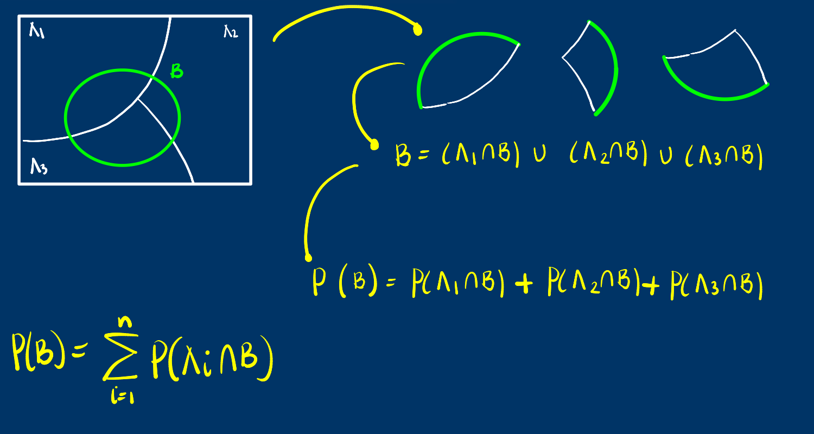
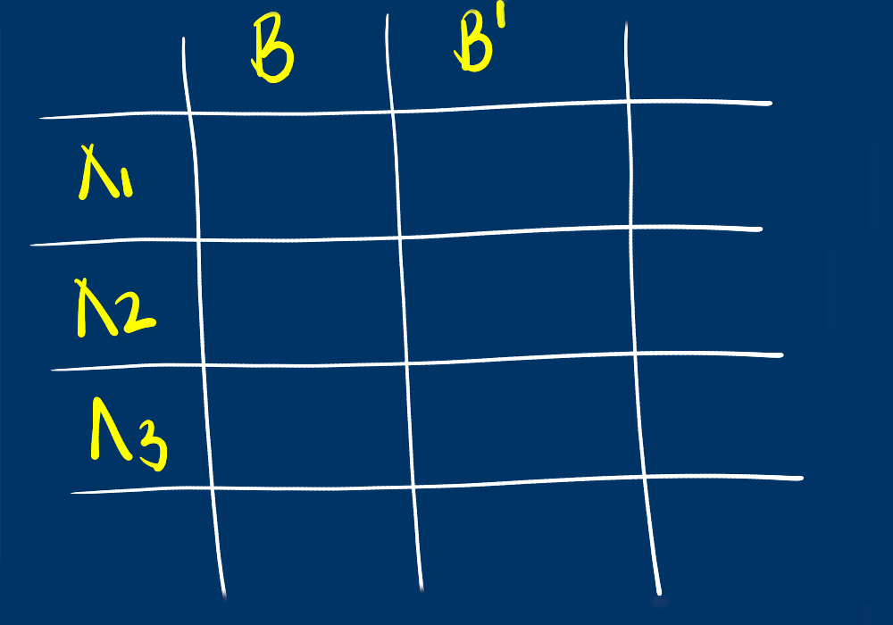
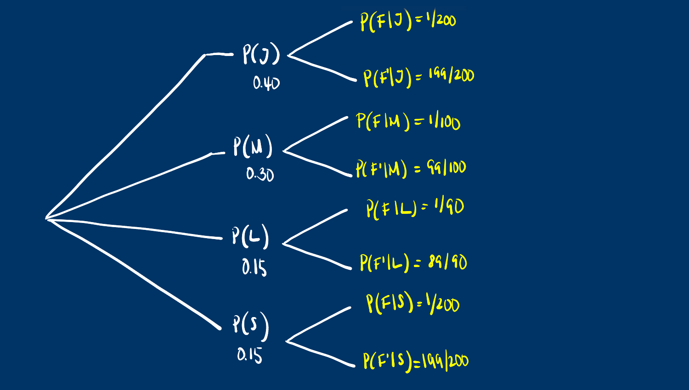
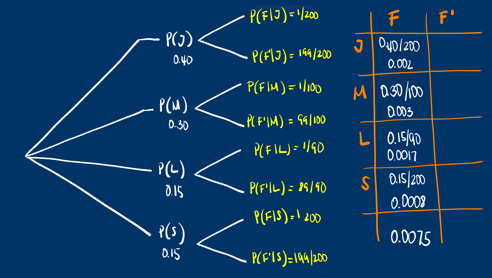
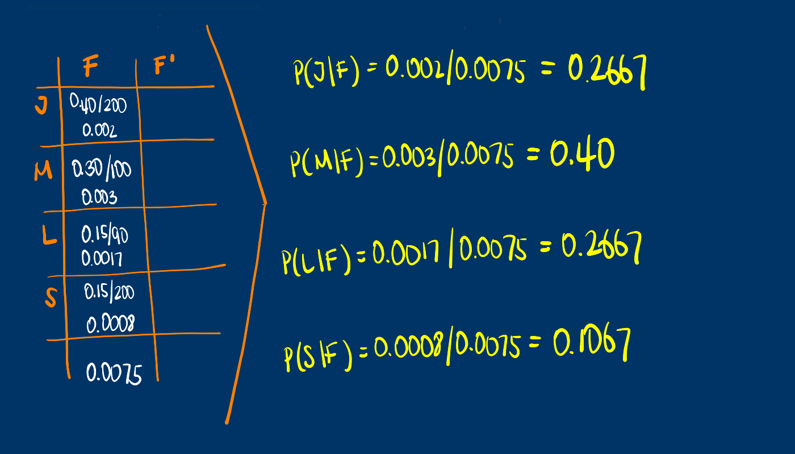

class: inverse
```{r setup, include=FALSE}
options(htmltools.dir.version = TRUE)
xaringanExtra::use_panelset()
```


<br/>
# AGENDA
<br/>
## 1. Dudas y preguntas

## 2. Probabilidad Total

## 3. Teorema de Bayes

## 4. Varios

---
class: inverse
---

## Conceptos básicos

+ **Experimento aleatorio** : acción que se puede repetir bajo las mismas condiciones y cuyo resultado no se conoce anticipadamente.

+ **Espacio muestral** : conjunto de todos los posibles resultados que puede tomar el experimento aleatorio.

+ **Evento aleatorios** : subconjunto del espacio muestral de nuestro interés

<br/><br/> 
**Enfoques de probabilidad**

**Clásico** : $P(A)=\dfrac{n(A)}{n(S)}$
<br/><br/>
**Frecuentista** : $\lim_{n \to{+}\infty}   P(A) =  \Bigg[ \dfrac{\text{número de veces que ocurre A}}{n} \Bigg]$

<br/>
<br/>
**Subjetivo** : $P(A)=$ asignada por un experto

---

**Axiomas de Probabilidad**

+ $A_{1}$:  Sea $S$ un espacio muestral  asociado a un experimento. Entonces $P(S)=1$ 

+ $A_{2}$:  Para cualquier evento $A$, se cumple que $0 \leq P(A) \leq 1$  

+ $A_{3}$:  Si $A$ y $B$ son dos eventos mutuamente excluyentes, entonces: 
$P(A \cup B) = P(A) + P(B)$ 

En general $P(A \cup B) = P(A)+ P(B) - P(A \cap B)$   

+ $A_{4}$: Para cualquier evento $A$, $P(A^c)$ = $1$ - $P(A)$  

+ $A_{5}$: La probabilidad de $P(\phi) =0$   

---
.pull-left[
**Particion** : 

Para un espacio muestral $S$ se divide en particiones $A_1$, $A_2$ ,... $A_n$  entonces : $P(S)=\sum_{i=1}^{n} P(A_{i})$
]
.pull-right[
**Probabilidad Total **

Si un espacio muestral $S$ esta particionado en eventos mutuamente expluyentes $A_1$, $A_2$ ,... $A_n$ y $B$ un evento cualquiera, entonces

$P(B)$ = $P(A_{1}\cap B)$ + $P(A_{2} \cap B)$ +... $P(A_{n}\cap B)$

]

<br/>
$P(B)$ = $P(B|A_{1})P(A_{1})$ + $P(B|A_{2})P(A_{2}))$ +... $P(B|A{n})P(A_{n})$
---
### Ejemplo
Los clientes de una reconocida marca de vehículos pueden pedir un motor de tres tamaños diferentes($A_{1}$, $A_{2}$ y $A_{3}$). De todos los automóviles vendidos, el 45% 
tiene motor pequeño, un 35% 
tienen motor mediano y el resto el mas grande. A los dos años de uso los autos son sometidos a una prueba de emisiones de gases y se observa que un 10% 
de los autos con motor pequeño no pasan la prueba, un 12% 
de los autos con motor mediano no pasan la prueba y  15% 
de los autos con motor grande tampoco pasan la prueba.

Cual es la probabilidad de que un automóvil que tiene un uso de dos años no pase la prueba de emisión de gases?

Nota: Problema tomado de Navidi(2006)
### Información:
.pull-left[
+ $P(A_{1})=0.45$

+ $P(A_{2})=0.35$

+ $P(A_{3})=0.20$
]
.pull-right[
+ $P(B|A_{1})=0.10$

+ $P(B|A_{2})=0.12$

+ $P(B|A_{3})=0.15$
]

$$P(B) = ?$$
---
class: inverse


---
class: inverse
### Probabilidad total


---
class: inverse
.pull-left[


]
.pull-right[

]
---
class: inverse
### Teorema de Bayes

Ahora si estamos interesados en valorar las probabilidad $P(A_{1}|B)$ , $P(A_{2}|B)$ o $P(A_{3}|B)$, es decir que si sabemos que un automóvil no paso la prueba de emisión de gases después de dos años de uso, cual modelo de automóvil es el mas probable que sea el que no cumplió con las pruebas?

.pull-left[

]
.pull-right[

]
---
class: inverse
### Ejemplo 2

En una fabrica de artículos para protección biodegradables, cuatro operarios colocan etiquetas de caducidad en cada artículo al final de la línea de producción. Juan, quien coloca la fecha de caducidad en un 40 % de los paquetes no
logra ponerla en uno de cada 200 paquetes; Maria, quien coloca en 30 % de los paquetes, no logra colocarla en uno
de 100 paquetes; Laura, quien coloca etiquetas en el 15 % de los paquetes, no lo hace una vez en 90 paquetes; y Santiago que fecha 15 % de los paquetes, falla en uno de cada 200 paquetes. Si un cliente se queja de que su paquete no
muestra la fecha de caducidad. ¿Cual de los empleados es el mas probable culpable de esta omisión?

---
class: inverse

---
class: inverse

---
class: inverse

---
class: inverse right
background-image: url("imagenes/couple-5267726_1920.jpg")
<br/><br/> 
<br/><br/> 
<br/><br/> 
<br/><br/> 
<br/><br/> 
<br/><br/> 
<br/><br/> 
<br/><br/> 
### <p style="color:yellow"> “Tu destino lo escribes tú mismo con cada decisión que tomas”...<br/><br/> (Betty Lepe) </p>
<p style="color:yellow"> Daniel Enrique González Gómez </p>
Imagen tomada de : https://pixabay.com/es/images/search/paisaje/