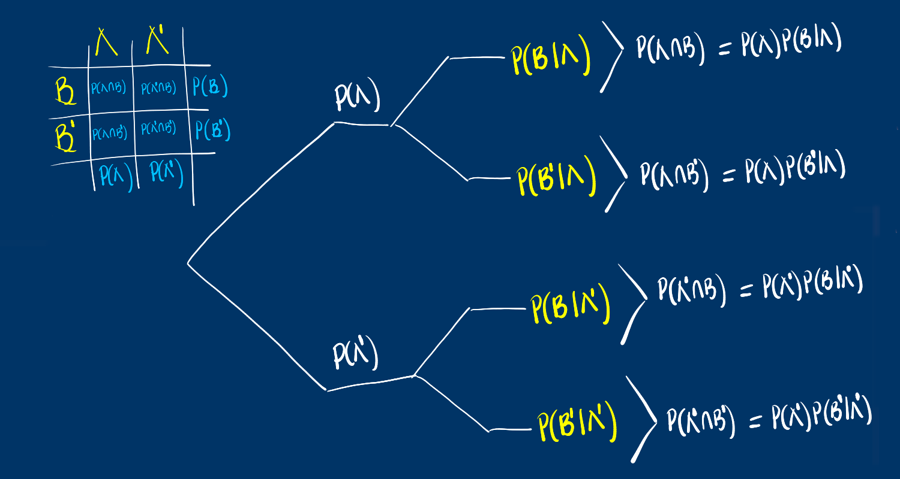
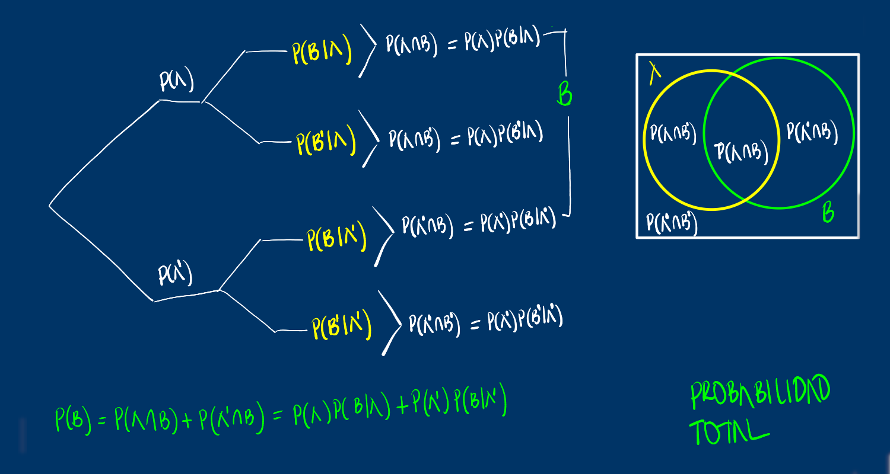
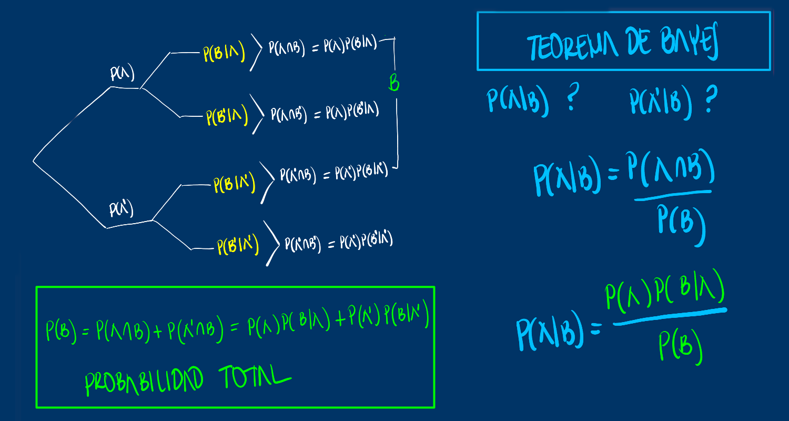
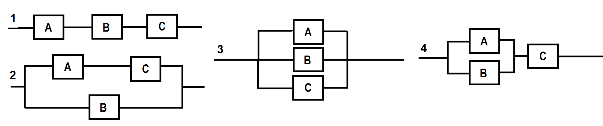

class: inverse, center, middle
```{r setup, include=FALSE}
options(htmltools.dir.version = TRUE)
xaringanExtra::use_panelset()
```
# MODULO 2
<br/><br/>
## PROBABILIDAD

---
class: inverse


---
class: inverse



---
class: inverse


---
class: inverse



---
### Problema 1
Determine cual de las siguienes configuraciones tiene mejor fiabilidad.  <br/>
Todos los componentes tienen igual probabilidad de falla (0.05) y funcionan de manera independiente


---
### Problema 2
Tres máquinas **A**, **B** y **C** producen respectivamente 60%, 30% y 10% del número total de artículos de una fábrica. Los porcentajes de desperfectos de producción de estas máquinas son respectivamente 2%, 3% y 4%. Seleccionando un artículo al azar resultó defectuoso. <br/><br/>
Hallar la probabilidad de que el artículo hubiera sido producido por la máquina **C**.  Es esta la máquina con mayor probabilidad de heber originado el problema?
---
class: center


[](https://www.youtube.com/watch?v=7KCkg0a_yGc)

Solución: https://rpubs.com/Kathe_Valle_Villa/675962

---
### Problema 3
Un lote de diez componentes contiene tres que están defectuosos. Se extraen aleatoriamente dos componentes y se evalúan. Sea **A** el evento de que el primer componente extraído esté defectuoso y sea **B** el evento de que el segundo también lo esté.

+ a) Determine $P(A)$.

+ b) Determine $P(B|A)$.

+ c) Determine $P(A \cap B)$.

+ d) Determine $P(A' \cap B)$.

+ e) Determine $P(B)$.

+ f) ¿Son $A$ y $B$ independientes? Explique.

---
class:inverse,right,center
background-image: url("imagenes/camino_a_seguir2.jpg")
<br/><br/> 
<br/><br/> 
<br/><br/> 
<br/><br/> 
<br/><br/> 
<br/><br/> 
<br/><br/> 
<br/><br/> 
### <p style="color:yellow"> “Para elegir tu camino debes informarte primero”...<br/><br/></p>
<p style="color:yellow"> Daniel Enrique González Gómez </p>
Imagen tomada de : https://pixabay.com/es/images/search/paisaje/


