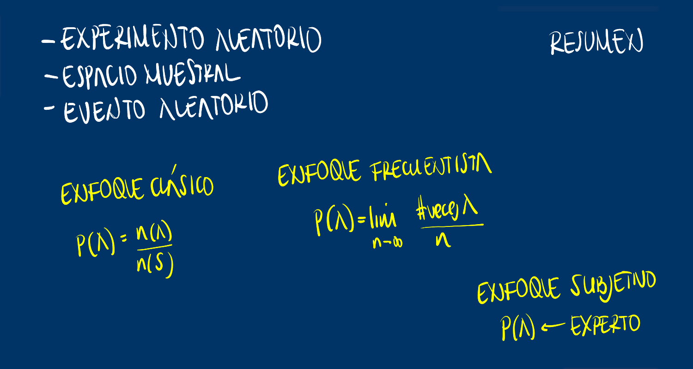

class: inverse, center, middle
```{r setup, include=FALSE}
options(htmltools.dir.version = TRUE)
xaringanExtra::use_panelset()
```
# MODULO
<br/><br/><br/>
## PROBABILIDAD

---
class: inverse


---
class: inverse


---
class: inverse


---
class: inverse


