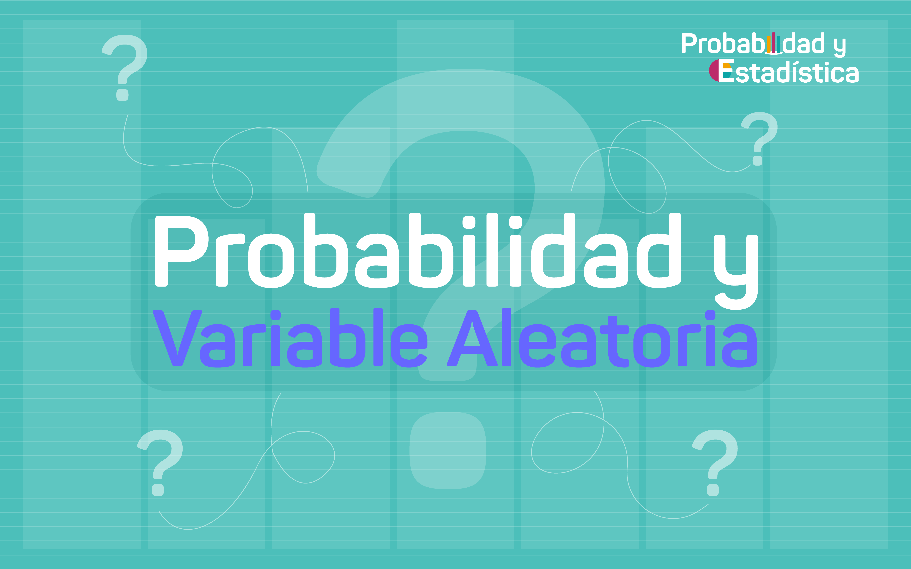
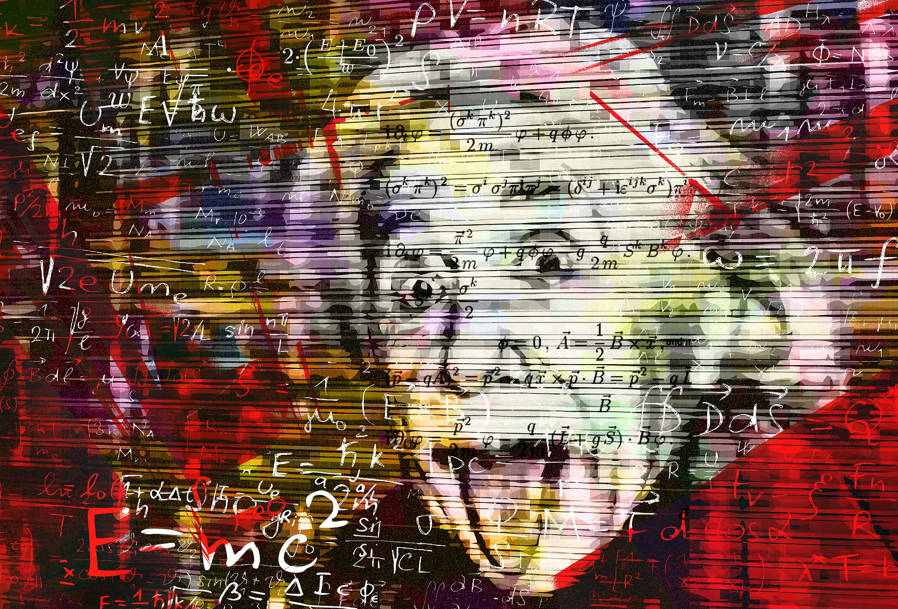

```{r setup, include=FALSE}
options(htmltools.dir.version = FALSE)
```

```{r xaringan-themer, include=FALSE, warning=FALSE}
library(xaringanthemer)
style_mono_light(base_color ="#383C69")
#2c5697") # color institucional puj  
#"#23395b") # color verde militar

```
class: inverse,  
# Variable aleatoria


## 1. Presentacaciòn Mòdulo 3

## 2. Presentaciòn Guìa 3.1

## 3. Variable aleatoria

## 4. Actividades


---
### ¿ Què es una variable? <br/>
--

### ¿ Que es una variable aleatoria ?<br/>
--

### ¿ Què caracterìsticas tiene ?<br/>
--

### ¿ Para que nos sirve estudiar caracterizaciòn?<br/>
--

### ¿ Còmo se relaciona este tema con lo que estudio ?<br/>
--

### Ejemplos de variables aleatorias <br/>

---
class: center inverse
### Variable aleatoria


<br/>
https://youtu.be/ABhDYVIfF0w


---
class: inverse, center 
### Caso variable aleatoria discreta


<br/>
https://youtu.be/CUMJ-MUiMaY

---
class: inverse, center 
### Caso variable aleatoria continua


<br/>
https://youtu.be/rlBxuLdOUt0
---
class: center

<br/>
#### <p style="color:blue"> “Los modelos matemàticos nos permiten entender la realizada”...</p>
<p style="color:blue"> Imagen tomada de: https://pixabay.com/es/images/search/paisaje/


